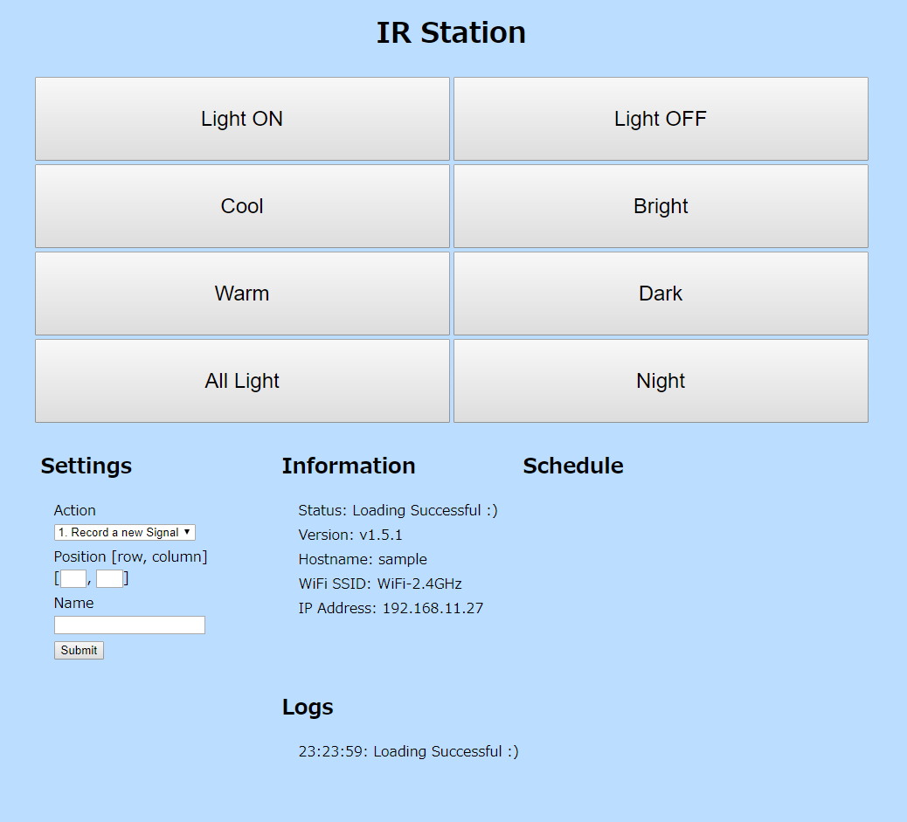

# IR Station

Infrared Remote Controller with ESP8266 WiFi-module  
You can control your home appliances with your smartphone or laptop.

## Main parts

  * ESP-WROOM-02 (ESP8266 WiFi Module)
  * IR Receiver
  * IR LED
  * Indicator LED

## Looks

### The Device's Appearance

### Display Sample

## How to Use

see [How to Use IR-Station](how-to-use.md)

## How to Make

see [How to Make IR-Station](how-to-make.md)

## API References

see [API References of IR-Station](api-references.md)
