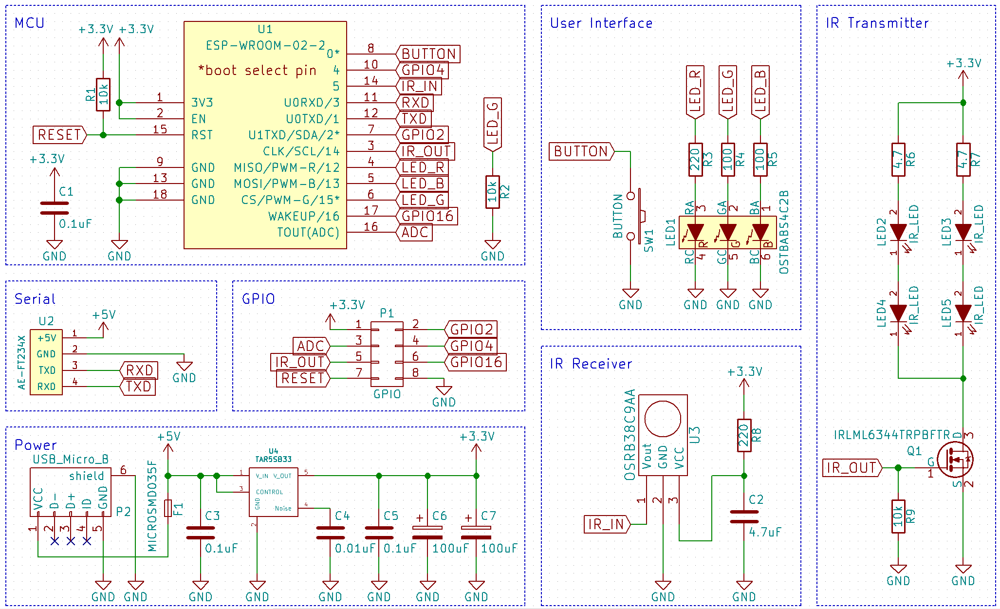
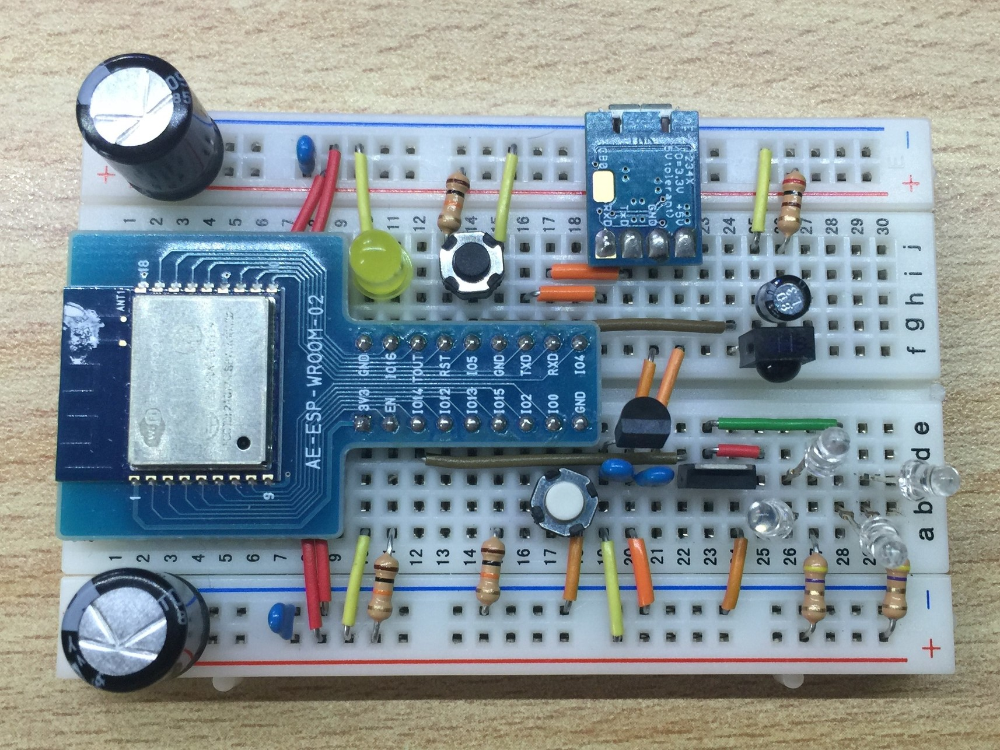

# IR station 

Infrared Remote Controller with ESP8266 WiFi-module  
You can control your home appliances with your smartphone or laptop.

# Hardware 

## Main parts

  * ESP-WROOM-02 (ESP8266 WiFi Module)
  * IR Receiver
  * IR LED
  * Indicator LED

# How to Use

## Setup the Device

  1. Supply power to the device.
  1. Connect your cellphone or laptop to Wi-Fi SSID "ESP8266-Remocon".
  1. Access http://esp8266.local in a browser
  1. Enter Wi-Fi SSID of your router and its password
  1. Enter a device name you like. Because it will be a part of URL, you cannot use space or symbol character.
  1. Click OK button.
  1. If connection succeeded, Wi-Fi "ESP8266-Remocon" will automatically disappear.
  1. Reconnect the power to reboot the device.
  1. Connect your cellphone or laptop to your router's Wi-Fi.
  1. Access http://DEVICE_NAME.local in a browser.
  1. If something appears, setup is complete.

## Store Signals

  1. Access http://DEVICE_NAME.local in a browser. DEVICE_NAME is the device name you entered previous form.
  1. Look at the form of the bottom of the screen.
  1. Select a channel you want to assign a signal.
  1. Enter a name of the signal. Don't use Japanese character.
  1. Click Recode button. An LED indicator will light.
  1. Press the button on the remote controller toward the device to store the signal.

## Remote Control

  1. Access http://DEVICE_NAME.local in a browser.
  1. Click a button which assigned a signal you want to send.

# How to Make

## Steps

  1. Gather the components.
  1. Assemble the components according to the circuit diagram.
  1. Connect the device and the PC with a serial-to-USB conversion module.
  1. Prepare Arduino IDE and serial-USB converter's driver.
  1. Open the preferences of Arduino IDE and fill in this URL: http://arduino.esp8266.com/stable/package_esp8266com_index.json to "Additional Boards Manager URLs".
  1. Add "Generic ESP8266 Module" in the Arduino IDE Board Manager.
  1. Open IR-station firmware in the Arduino IDE.
  1. Select "Generic ESP8266 Module" and configure each item of board settings properly. See Arduino Board Settings below.
  1. Select correct serial COM port and upload program to the device. When upload program, GPIO0 and GPIO2 must be pulled-up, and GPIO15 must be pulled-down. It's necessary to reset the devie immediately before upload. It's a little difficult.
  1. The uploading takes about 30 seconds.
  1. Process termination.

## Components

### Device Components

|Components|Details|Quantity|
|:-------------|:-------|:--------|
| ESP8266 WiFi Module | ESP8266 | 1 |
| IR receiver | PL-IRM0101-3 or equivalents | 1 |
| IR LED | anything good | 2~4 |
| Nch FET | BS170 or equivalents | 1 |
| IR LED Current Regulation Resistor | 10 ohm, 1W | 1 |
| Pull-up/down Resistor | 10k ohm | 5 |
| Indicator LED | anything good | 2 |
| Voltage Regulator | output: 3.3V 150mA or more | 1 |
| Bypass Capacitor | 0.1uF | 2~3 |
| Power Stabilization Capacitor | 470uF~1000uF | 1 |

### Optional Device Components

|Components|Details|Quantity|
|:-------------|:-------|:--------|
| Reset Switch | tact switch | 1 |
| Program Upload Switch | tact switch | 1 |

### Requires

| Requires |Details|Quantity|
|:------|:-------|:--------|
| Serial-to-USB conversion Module | such as FT232  | 1 |
| Power Supplyer | over 3.3V | 1 |

## Circuit Diagram

## Sample

## Arduino Board Settings

| item | select |
| :---- | :---------------------- |
| Board | Generic ESP8266 Module |
| Flash Mode | QIO |
| Flash Frequency | 40MHz |
| Upload Using | Serial |
| CPU Frequency | 80MHz |
| Flash Size | 4M\(3M SPIFFS\) |
| Reset Method | ck |
| Upload Speed | 115200 |
