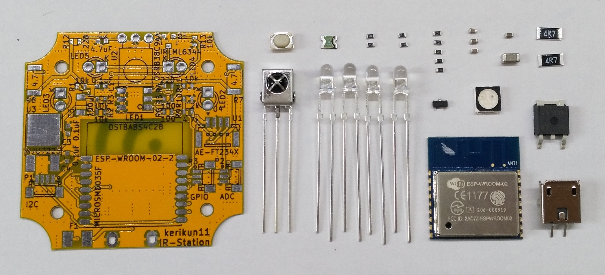
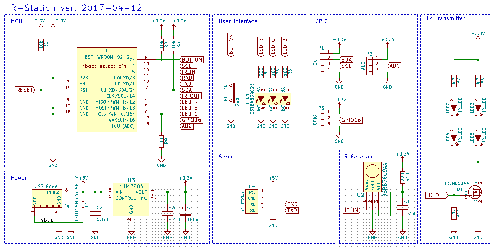
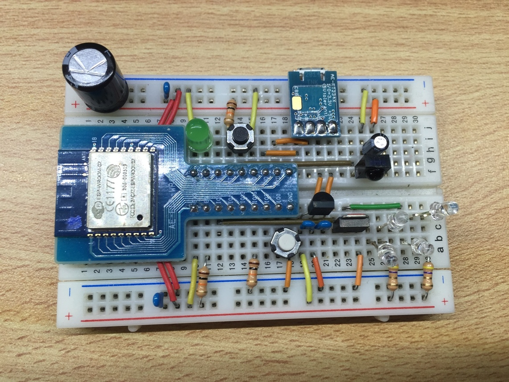
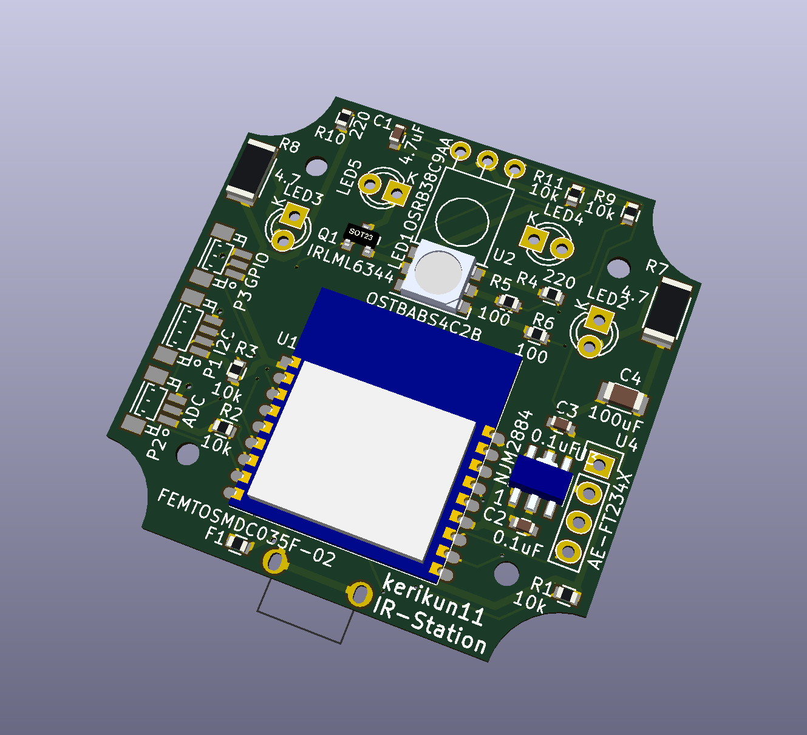
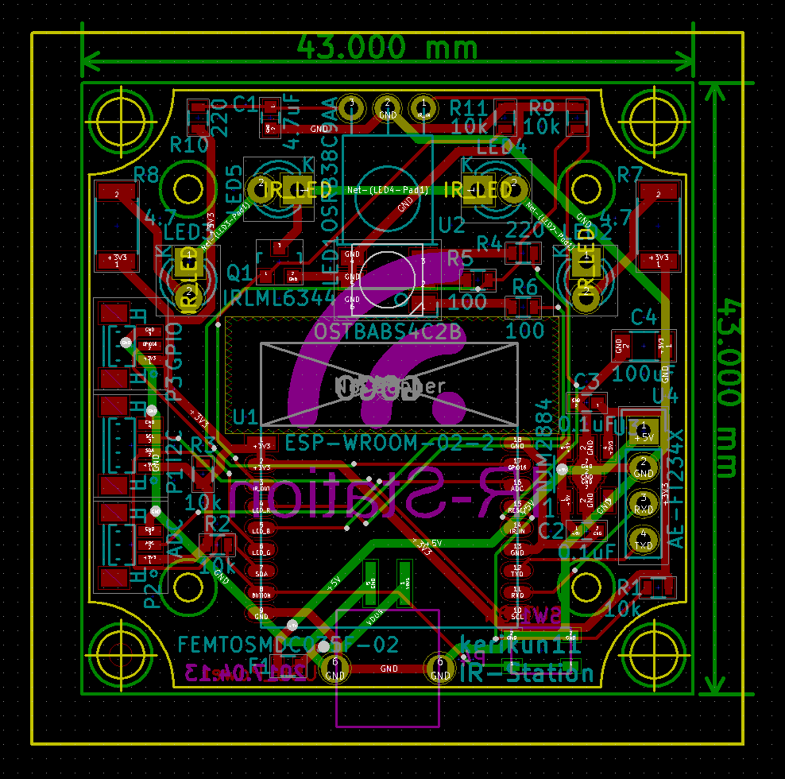

# IR Station 

Infrared Remote Controller with ESP8266 WiFi-module  
You can control your home appliances with your smartphone or laptop.

## Main parts

  * ESP-WROOM-02 (ESP8266 WiFi Module)
  * IR Receiver
  * IR LED
  * Indicator LED

## Looks

### The Device's Appearance

### Display Sample

## How to Use

### Setup the Device

  1. Supply power to the device.
  1. Connect your cellphone or laptop to Wi-Fi SSID "IR-Station".
  1. Access http://192.168.4.1 in a browser
  1. Enter Wi-Fi SSID of your home and its password
  1. Enter a device name you like. We call it the hostname. Because it will be a part of URL, you cannot use space character.
  1. If connection succeeded, IR-Station's local IP address is displayed. Please make a note of it.
  1. Connect your cellphone or laptop to your home's Wi-Fi.
  1. Access http:/xxx.xxx.xx.xx (IR-Station's local IP address) in a browser. (for example http://192.168.11.3 )
  1. If something appears, setup is complete.

### Store Signals

  1. Access http:/192.168.xx.xx (one example) in a browser.   1. Look at the form of the bottom of the screen.
  1. Select "record a new Signal" action.
  1. Select a channel you want to assign a new signal.
  1. Enter a name of the signal.
  1. When you click the "Submit" button, the green LED of your IR-Station will light up.
  1. Press a button on your remote controller toward your IR-Station to store a new signal.

### Remote Control

  1. Access your IR-Station in a browser.
  1. Click a button which assigned a signal you want to send.

### Meanings of LED Indicator

|Color	|Status	|
|:----------|:-----------|
|Red	|Error	|
|Green	|Booting, Sending Signal or Receiving Signal	|
|Blue	|Listening	|

## How to Make

### Required Library

Please Add the Libraries below to your Arduino IDE

  * Arduino TimeLib (https://github.com/PaulStoffregen/Time/blob/master/TimeLib.h)
  * Arduino Json (https://github.com/bblanchon/ArduinoJson)

### Steps

  1. Gather the components.
  1. Assemble the components according to the circuit diagram.
  1. Connect the device and the PC with a serial-to-USB conversion module.
  1. Prepare Arduino IDE and serial-USB converter's driver.
  1. Open the preferences of Arduino IDE and fill in this URL: http://arduino.esp8266.com/stable/package_esp8266com_index.json to "Additional Boards Manager URLs".
  1. Add "Generic ESP8266 Module" in the Arduino IDE Board Manager.
  1. Add the required libraries to your Arduino IDE in the Arduino IDE Library Manager or zip files.
  1. Open IR-station firmware in the Arduino IDE.
  1. Select "Generic ESP8266 Module" and configure each item of board settings properly. See Arduino Board Settings below.
  1. Select correct serial COM port and upload program to the device. When upload program, GPIO0 and GPIO2 must be pulled-up, and GPIO15 must be pulled-down. It's necessary to reset the devie immediately before upload. It's a little difficult.
  1. The uploading takes about 30 seconds.
  1. Upload the SPIFFS data: menu -> tool -> ESP8266 Sketch Data Upload. (See https://github.com/esp8266/Arduino/blob/master/doc/filesystem.md)
  1. Process termination.

### Arduino Board Settings

| item | select |
| :---- | :---------------------- |
| Board | ESPino (ESP-12 Module) |
| Flash Mode | QIO |
| CPU Frequency | 80MHz |
| Flash Size | 4M\(3M SPIFFS\) |
| Reset Method | ck |
| Upload Speed | 115200 |

### Components

#### Device Components

|Components					|Details		|Quantity	|Remarks					|
|:--------------------------|:--------------|:----------|:--------------------------|
|ESP8266 WiFi Module		|ESP-WROOM-02	| 1 		|							|
|IR receiver				|OSRB38C9AA		| 1 		|Power: 3.3V				|
|IR LED						|OSI5FU3A11C	| 2 or 4 	|anything maybe OK			|
|Voltage Regulator			|NJU7223-33		| 1 		|output: 3.3V 500mA	|
|Nch MOS-FET				|IRLML6344		| 1 		|							|
|Resistor for IR LED		|4.7 ohms, 1W	| 1 or 2 	|							|
|Pull-up/down Resistor		|10k ohms 		| 5 		|							|
|Indicator LED				|LATBT66B		| 1 		|							|
|Resistor for LED			|100~220 ohms	| 3 		|							|
|Resistor for IR receiver	|220 ohms		| 1 		|							|
|Capacitor for IR receiver	|4.7uF 			| 3 		|							|
|Power Stabilization Capacitor	|220uF~470uF| 1			|							|
|Bypass Capacitor			|0.1uF 			| 3 		|							|
|User Button				|SKRPACE010 	| 1			|							|
|Poly Switch				|MICROSMD035F-02| 1			|up to 350mA				|
|USB Conncector				|USB-Micro-B	| 1			|Power Only					|

#### Requires

| Requires |Details|Quantity|
|:------|:-------|:--------|
| Serial-to-USB conversion Module | such as FT232  | 1 |

### Circuit Diagram

### Breadboard Sample

### 3D shape

### PCB pattern sample

## IR data JSON format

### format

~~~json
{
	"data":[uint16_t microseconds_high, uint16_t microseconds_low, uint16_t microseconds_high, uint16_t microseconds_low, ... ],
	"name":"name of button"
}
~~~

### Sample

~~~json
{
	"data":[
		3300,1786,363,1305,390,473,364,476,317,548,289,577,288,501,364,474,390,475,290,550,289,1403,290,551,314,1377,290,552,313,502,362,1379,289,1378,289,1378,314,1377,389,1304,364,476,312,552,290,553,312,474,391,1305,362,501,364,474,361,504,289,553,312,477,363,500,364,476,287,578,289,1377,314,551,290,502,363,476,388,474,391,451,313,551,313,553,288,500,363,1304,385,1362,310,475,389,475,364,477,313,552,288,1380,317,50215,3305,3489,314
	],
	"name":"TV Power"
}
~~~

## HTTP API

### Setup Form

#### GET /

|Parameter	|Type	|Remarks	|
|:----------|:------|:----------|
|none		|		|			|

|Response	|Code	|Type	|Remarks	|
|:----------|:------|:------|:----------|
|Setup Page	|200	|text/html	|			|

#### GET /wifi-list

|Parameter	|Type	|Remarks	|
|:----------|:------|:----------|
|none		|		|			|

|Response	|Code	|Type	|Remarks	|
|:----------|:------|:------|:----------|
|a list of WiFi SSIDs which exist	|200	|list of string	|takes a little time	|

Response Sample

~~~http
HTTP/1.1 200 OK
Content-Type: text/plain
Content-Length: ???
Connection: close
Access-Control-Allow-Origin: *

["SSID1","SSID2","SSID3",...,"SSIDn"]
~~~

#### GET /confirm

|Parameter	|Type	|Remarks	|
|:----------|:------|:----------|
|ssid		|text/plain	|			|
|password	|text/plain	|			|
|hostname	|text/plain	|			|
|stealth	|text/plain	|"true" or "false"	|

|Response	|Code	|Type	|Remarks	|
|:----------|:------|:------|:----------|
|only code	|200	|		|			|

#### GET /isConnected

|Parameter	|Type	|Remarks	|
|:----------|:------|:----------|
|none		|		|			|

|Response	|Code	|Type	|Remarks	|
|:----------|:------|:------|:----------|
|status		|200	|text/plain	|"false" or local IP address|

#### GET /test

for developers

|Parameter	|Type	|Remarks	|
|:----------|:------|:----------|
|ssid		|text/plain	|			|
|password	|text/plain	|			|

|Response	|Code	|Type	|Remarks	|
|:----------|:------|:------|:----------|
|status		|200	|text/plain	|"successful" or "failed"|

### Main Page

#### GET /

|Parameter	|Type	|Remarks	|
|:----------|:------|:----------|
|none		|		|			|

|Response	|Code	|Type	|Remarks	|
|:----------|:------|:------|:----------|
|Main Page	|200	|text/html	|			|

#### GET /name-list

|Parameter	|Type	|Remarks	|
|:----------|:------|:----------|
|none		|		|			|

|Response	|Code	|Type	|Remarks	|
|:----------|:------|:------|:----------|
|a list of channel names |200	|list of string	|	|

Response Sample

~~~http
HTTP/1.1 200 OK
Content-Type: text/plain
Content-Length: ???
Connection: close
Access-Control-Allow-Origin: *

["name of ch 1","name of ch 2",...,"name of ch n"]
~~~

#### GET /send

|Parameter	|Type	|Remarks	|
|:----------|:------|:----------|
|ch			|number	|			|

|Response	|Code	|Type	|Remarks	|
|:----------|:------|:------|:----------|
|status		|200	|text/plain	|			|

#### GET /record

|Parameter	|Type	|Remarks	|
|:----------|:------|:----------|
|ch			|number	|			|

|Response	|Code	|Type	|Remarks	|
|:----------|:------|:------|:----------|
|status		|200	|text/plain	|			|

#### GET /rename

|Parameter	|Type	|Remarks	|
|:----------|:------|:----------|
|ch			|number	|			|
|name		|string	|new name	|

|Response	|Code	|Type	|Remarks	|
|:----------|:------|:------|:----------|
|status		|200	|text/plain	|			|

#### GET /IR\_data/1.json

1.json, 2.json, ... , n.json  
n is channel number

|Parameter	|Type	|Remarks	|
|:----------|:------|:----------|
|none		|		|			|

|Response	|Code	|Type	|Remarks	|
|:----------|:------|:------|:----------|
|irJson		|200	|application/json	|			|

#### GET /upload

|Parameter	|Type	|Remarks	|
|:----------|:------|:----------|
|ch			|number	|			|
|name		|string	|new name	|
|irJson		|json	|signal data|

|Response	|Code	|Type	|Remarks	|
|:----------|:------|:------|:----------|
|status		|200	|text/plain	|			|

#### GET /clear

|Parameter	|Type	|Remarks	|
|:----------|:------|:----------|
|ch			|number	|			|

|Response	|Code	|Type	|Remarks	|
|:----------|:------|:------|:----------|
|status		|200	|text/plain	|			|

#### GET /clear-all

|Parameter	|Type	|Remarks	|
|:----------|:------|:----------|
|none		|		|			|

|Response	|Code	|Type	|Remarks	|
|:----------|:------|:------|:----------|
|status		|200	|text/plain	|			|

#### GET /increment-channels

|Parameter	|Type	|Remarks	|
|:----------|:------|:----------|
|nuber		|number	|			|

|Response	|Code	|Type	|Remarks	|
|:----------|:------|:------|:----------|
|status		|200	|text/plain	|			|

#### GET /decrement-channels

|Parameter	|Type	|Remarks	|
|:----------|:------|:----------|
|nuber		|number	|			|

|Response	|Code	|Type	|Remarks	|
|:----------|:------|:------|:----------|
|status		|200	|text/plain	|			|

#### GET /disconnect-wifi

|Parameter	|Type	|Remarks	|
|:----------|:------|:----------|
|none		|		|			|

|Response	|Code	|Type	|Remarks	|
|:----------|:------|:------|:----------|
|status		|200	|text/plain	|			|

#### GET /info

|Parameter	|Type	|Remarks	|
|:----------|:------|:----------|
|none		|		|			|

|Response	|Code	|Type	|Remarks	|
|:----------|:------|:------|:----------|
|a list of information |200	|list of string	|	|

Response Sample

~~~http
HTTP/1.1 200 OK
Content-Type: text/plain
Content-Length: ???
Connection: close
Access-Control-Allow-Origin: *

["status","SSID","Local IP address","mDNS URL"]
~~~
