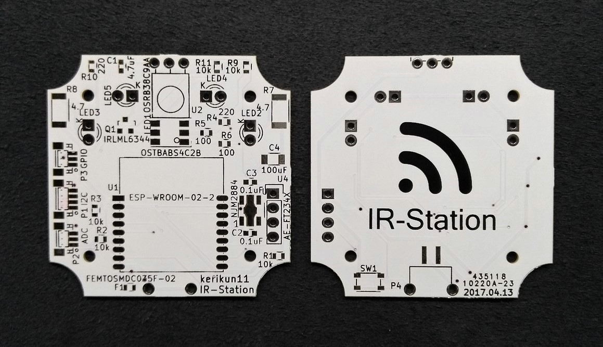
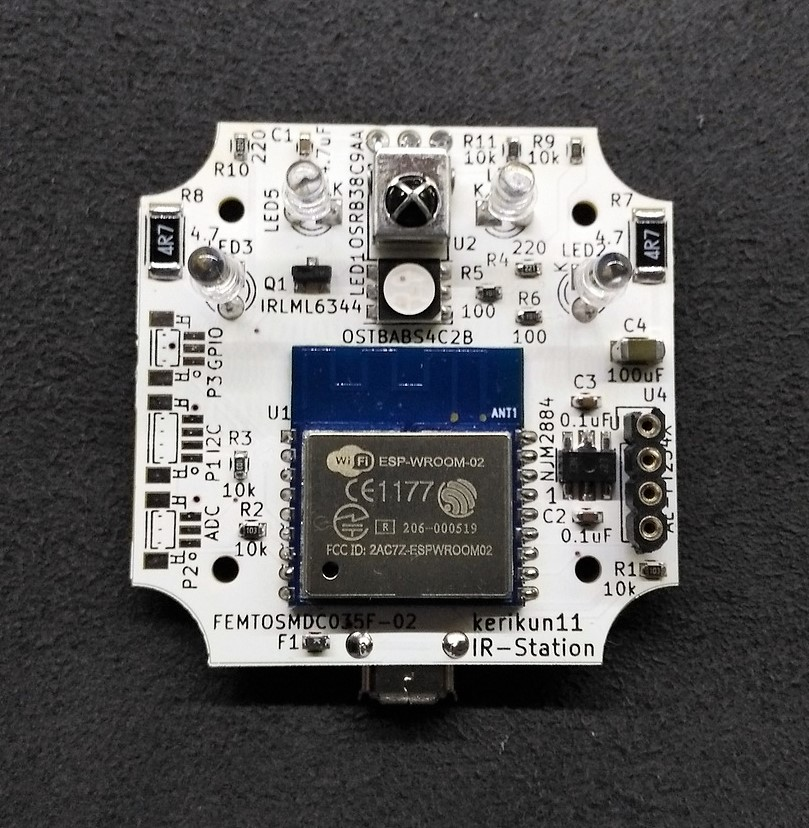
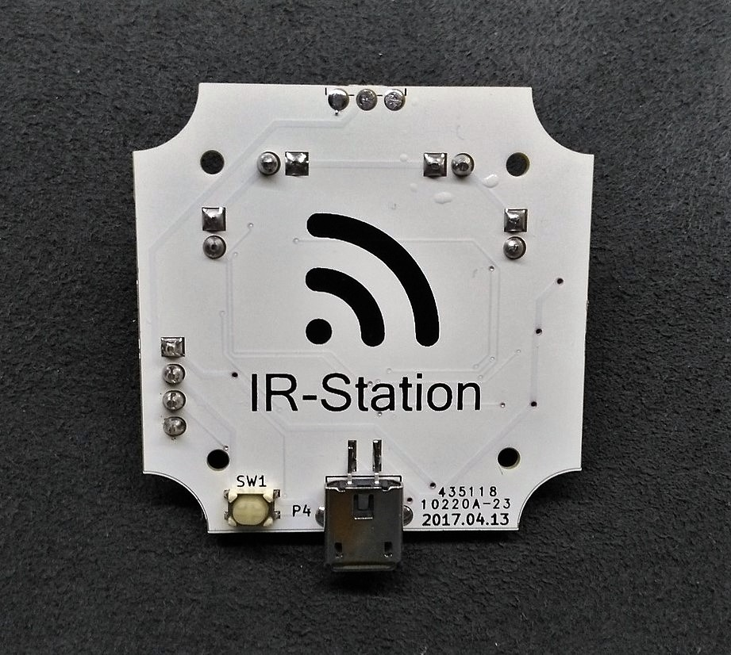

# IR-Station

Infrared Remote Controller with ESP8266 WiFi-module  
You can control your home appliances with your smartphone or laptop.

## How to Make IR Station

### Components

#### Device Components

| Components            | Details             | Qty  | Remarks                       |
| :-------------------- | :------------------ | :--- | :---------------------------- |
| ESP8266 WiFi Module   | ESP-WROOM-02        | 1    | MCU                           |
| IR receiver           | OSRB38C9AA          | 1    | Power: 3.3V                   |
| IR LED                | OSI5FU3A11C         | 4    | 940nm, 100mA, 3mm             |
| Voltage Regulator     | NJM2884U1-33        | 1    | 3.3V 500mA                    |
| Nch MOS-FET           | IRLML6344           | 1    | to drive IR LED               |
| Resistor              | 4.7 ohms, 1W (5025) | 2    | for IR LED                    |
| Pull-up/down Resistor | 10k ohms            | 5    |                               |
| Indicator LED         | OSTBABS4C2B         | 1    | RGB LED                       |
| Resistor              | 100~220 ohms (1608) | 3    | for Indicator LED             |
| Resistor              | 220 ohms (1608)     | 1    | for IR receiver               |
| Capacitor             | 4.7uF (1608)        | 1    | for IR receiver               |
| Capacitor             | 0.1uF (1608)        | 2    | for Regulator Input/Output    |
| Capacitor             | 100uF (3216)        | 1    | Power Stabilization Capacitor |
| User Button           | SKRPACE010          | 1    | User Button                   |
| Poly Switch           | FEMTOSMDC035F-02    | 1    | up to 350mA                   |
| USB Conncector        | MRUSB-2B-D14NI-S306 | 1    | USB-Micro-B, Power Only       |
| Case                  | TW5-2-5 or TWF5-2-5 | 1    | drilling is required          |

#### Requires

| Requires                        | Details       | Quantity |
| :------------------------------ | :------------ | :------- |
| Serial-to-USB conversion Module | such as FT232 | 1        |

### Circuit Diagram

### Required Library

IR-Station is based on Arduino Environment.  
Please Add the Libraries below to your Arduino IDE.

- Arduino Json (https://github.com/bblanchon/ArduinoJson) v5.13.4
- Arduino Time Library (https://github.com/PaulStoffregen/Time) v1.5.0

### Arduino Board Settings

- Board Set: [ESP8266 core for Arduino](https://github.com/esp8266/Arduino) v2.6.3

| item          | select                 |
| :------------ | :--------------------- |
| Board         | ESPino (ESP-12 Module) |
| Flash Mode    | QIO                    |
| CPU Frequency | 160MHz                 |
| Flash Size    | 4M (1M SPIFFS)         |
| Reset Method  | ck                     |
| Upload Speed  | 115200                 |

### Steps

  1. Install [Arduino IDE](https://www.arduino.cc/) on your PC.
  1. Install ESP8266 Environment on the Arduino IDE. (see https://github.com/esp8266/Arduino)
  1. Add the required libraries to your Arduino IDE in the Arduino IDE Library Manager or zip files.
  1. Select "Generic ESP8266 Module" and configure each item of board settings properly. See Arduino Board Settings above.
  1. Connect your IR-Station and your PC with a UART-to-USB conversion module.
  1. Select correct serial COM port and upload program to the device. When upload program, GPIO0 and GPIO2 must be pulled-up, and GPIO15 must be pulled-down.
  1. The uploading takes about 30 seconds.
  1. Upload the SPIFFS data: menu -> tool -> ESP8266 Sketch Data Upload. (See https://github.com/esp8266/Arduino/blob/master/doc/filesystem.rst#uploading-files-to-file-system)
  1. Process termination. Just boot the device.

## Appendix

### Breadboard Sample

### 3D shape

### PCB pattern sample

### Printed Circuit Board

### Board Sample

