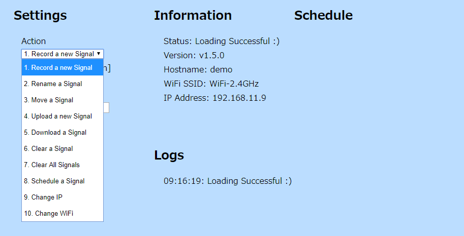
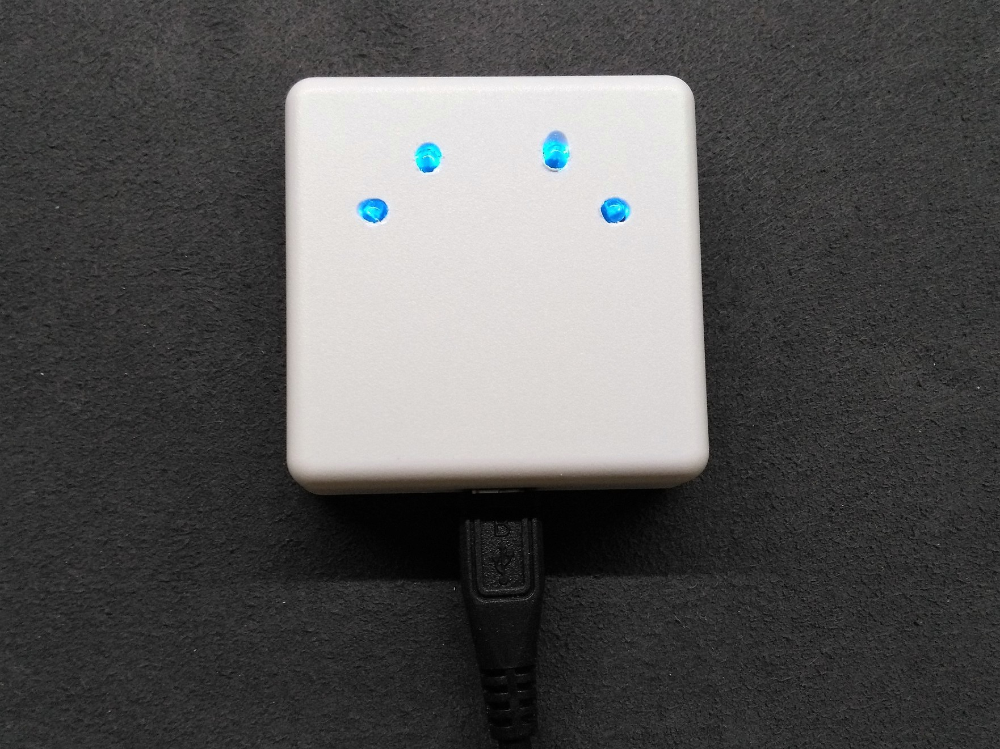

# IR Station

Infrared Remote Controller with ESP8266 WiFi-module  
You can control your home appliances with your smartphone or laptop.

### Display Sample

## How to Use IR-Station

### Setup the Device

  1. Supply power to the device.
  1. Connect your cellphone or laptop to Wi-Fi SSID "IR-Station". Its password is "IR-Station".
  1. Access http://192.168.4.1 in a browser
  1. Enter Wi-Fi SSID of your home and its password.
  1. Enter a device name you like. We call it the hostname. Because it will be a part of URL, you cannot use space character.
  1. If connection succeeded, IR-Station's local IP address is displayed. Please make a note of it.
  1. Connect your cellphone or laptop to your home's Wi-Fi.
  1. Access http:/xxx.xxx.xx.xx (IR-Station's local IP address) in a browser. (for example http://192.168.11.3 )
  1. If something appears, setup is complete.

### Store Signals

  1. Access http:/192.168.xx.xx (one example) in a browser.
  1. Look at the form of the bottom of the screen.
  1. Select "record a new Signal" action.
  1. Select a channel you want to assign a new signal.
  1. Enter a name of the signal.
  1. When you click the "Submit" button, the green LED of your IR-Station will light up.
  1. Press a button on your remote controller toward your IR-Station to store a new signal.

### Remote Control

  1. Access your IR-Station in a browser.
  1. Click a button which assigned a signal you want to send.

### Available Functions

  * Record a new Signal
  * Rename a Signal
  * Move a Signal
  * Upload a Signal
  * Download a Signal
  * Clear a Signal
  * Clear all Signals
  * Schedule a Signal
  * Change IP (Fix IP Address)
  * Change WiFi (Disconnect WiFi)

### Meanings of LED Indicator

|Color	|Status		|
|:------|:----------|
|Red	|Error		|
|Green	|Processing	|
|Blue	|Listening	|

