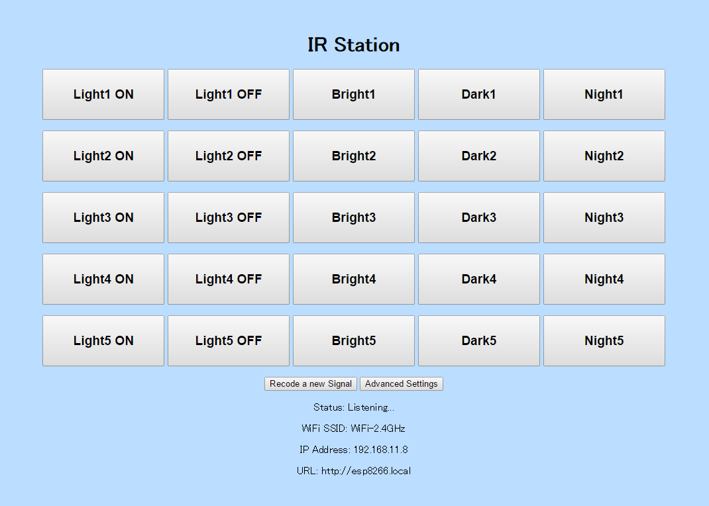

# Server Demo

You can test IR-station server in your local development environment.

## Kinds

### general

"general" is a main page of IR-station.

### form

"form" is a page that sets up IR-station.

## Reqirements

	$ gem install sinatra
	$ gem install sinatra-contrib

## Run

	$ ruby app.rb -p 4567 -o 0.0.0.0

Access http://localhost:4567 to see it.
